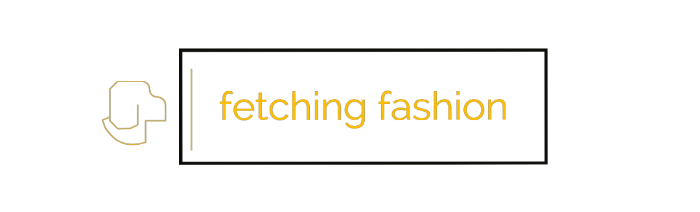

    
    <h1 align=center>Fetching Fashion Co</h1>
    <h3 align=center>Get Your Paws on Fetching Fashion - The Bark of the Town!</h3>
    
Online Dog Clothing Site

## Planning and Research Log

-   Learning Redux
-   Following tutorial on redux toolkit (still working x5) https://www.youtube.com/watch?v=NqzdVN2tyvQ&t=10380s&ab_channel=DaveGray
-   Learning about CMS and HEADLESS CMS (Content Management System)
-   Learning about Strapi (Headless CMS)
-   Learning about MongoDb x3
-   Learning about Mongoose and Express and Node x4

## License
